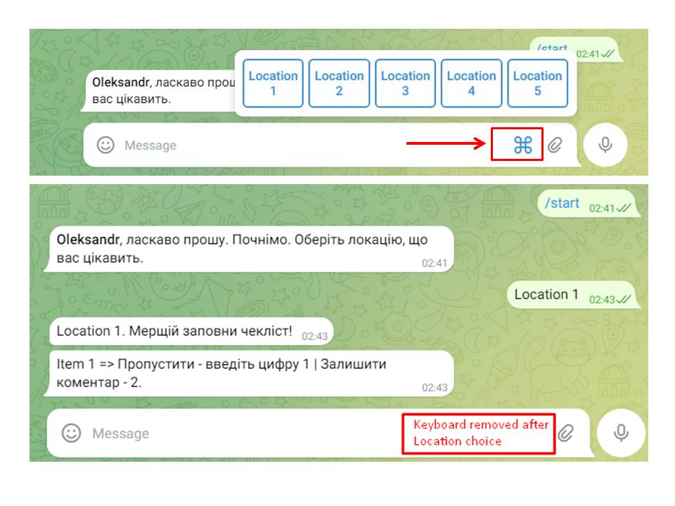

Тестове завдання: 
Бібліотеки aiogram ( версія 2.25 ) та OpenAI. 
Завдання - простий Telegram-бот: • відправляє вітальне повідомлення користувачам при їх першому зверненні до бота;

• після чого, бот має дати можливість користувачу вибрати одну з 5 локацій ( Локація 1, Локація 2, Локація 3, Локація 4, Локація 5) та заповнити чек-лист; 

• в чек-лист необхідно включити  5 пунктів з можливістю обрати варіант:  "Все чисто" або "Залишити коментар";

• після коментаря, має бути можливість завантажити фотографію та зберегти посилання на неї;

• після завершення чек-листа, має сформуватись звіт, який відправиться на OpenAI для аналізу штучним інтелектом. Проаналізований звіт відправити користувачу. 

Технічні вимоги:
Створення бота:
Створіть новий бот у Telegram через BotFather.
Налаштуйте бота за допомогою бібліотеки aiogram.

Вітальне повідомлення:
Бот повинен відправляти вітальне повідомлення користувачу при першому зверненні до бота. Повідомлення може бути простим текстом, наприклад: "Привіт! Почнімо працювати."

Використовуйте бібліотеку OpenAI для аналізу сформованого звіту.

Надсилання текстової версії:
Після аналізу, бот повинен надсилати цей текст користувачу у вигляді текстового повідомлення в Telegram.

Додаткові вимоги:
Код має бути чітким та добре структурованим.
Використовуйте коментарі для пояснення ключових частин коду.
Використовуйте обробку помилок для управління можливими винятками під час роботи бота.

Ще: від 2 годин до дня робиться це завдання, залежно від навичок. 
Локація - це клавіатура з 5 кнопками, і там є назва локації, яку можна  
обрати. До цієї локації є 5 запитань (однакові по всіх локаціях).
На кожне питання з чек-листа є 2 варіанти - "Все чисто" і другий, який 
треба завантажити.. Після другого коментаря треба завантажити фото.

У вигляді текстового повідомлення. І так вислати на openai  та повернути відповідь до користувача.

_____________________________________________________

aiogram is a modern and fully asynchronous framework for Telegram Bot API written in Python 3.8 using asyncio and aiohttp. 

Run:
python -m venv venv
venv\scripts\activate

pip install -r requirements.txt

py main.py

Finally, open Telegram API bot. Enjoy.

## Results

## 
p.s telegbot_aiogr3.3 папку проігноруйте