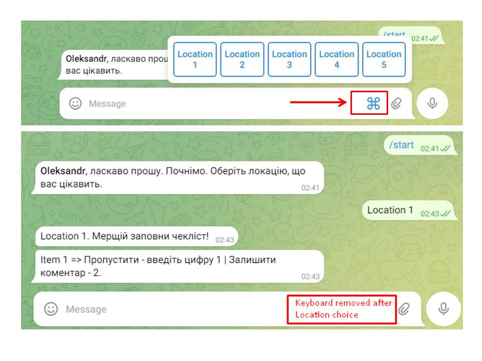
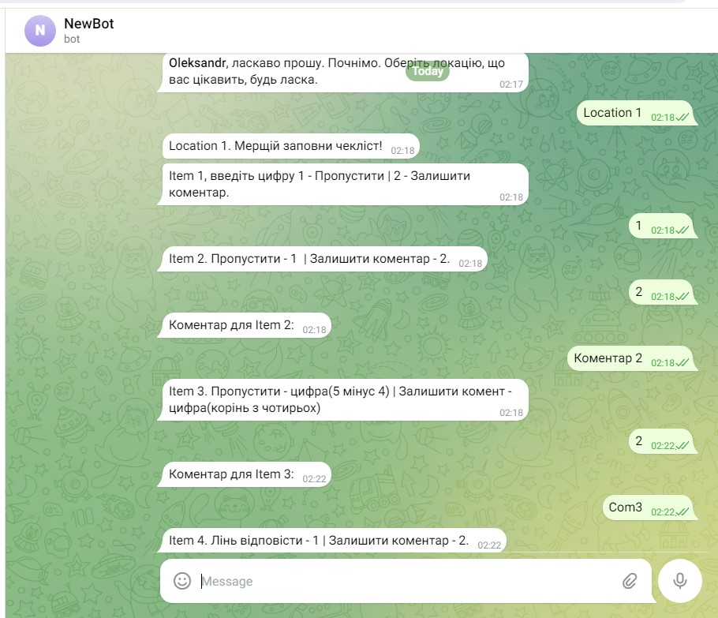
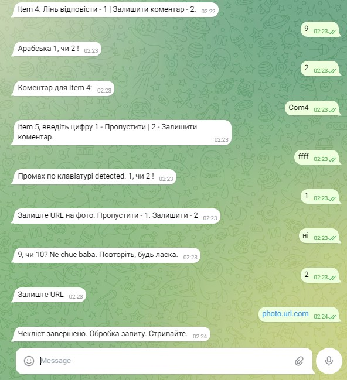
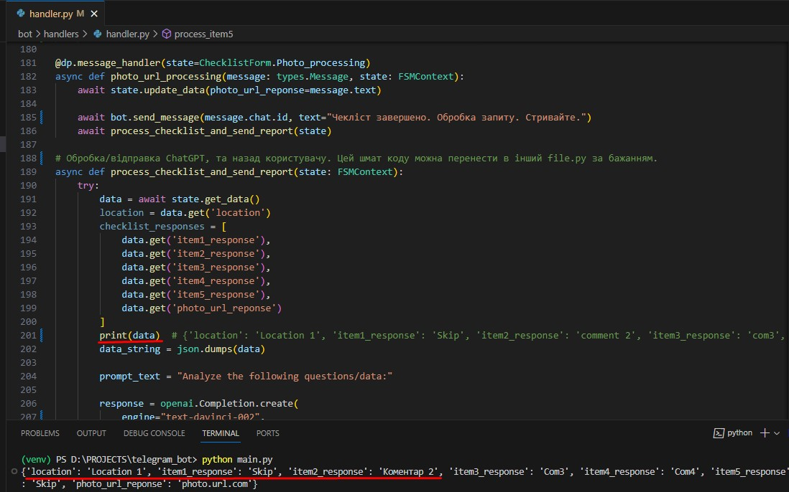

aiogram is a modern and fully asynchronous framework for Telegram Bot API written in Python 3.8 using asyncio and aiohttp. 

Run:
python -m venv venv
venv\scripts\activate

pip install -r requirements.txt

py main.py

Finally, open Telegram API bot. Enjoy.

## Results

## 
p.s telegbot_aiogr3.3 папку проігноруйте