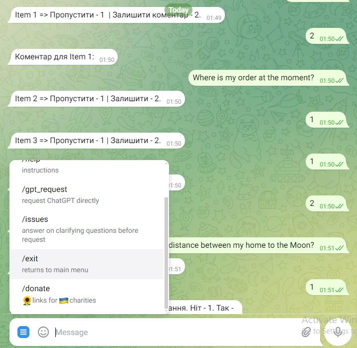

## Overview

___________________________________

Тестове завдання: 
Бібліотеки aiogram ( версія 2.25. Перероблюю на 2.92 ) та OpenAI. 
Завдання - простий Telegram-бот: • відправляє вітальне повідомлення користувачам при їх першому зверненні до бота;

• після чого, бот має дати можливість користувачу вибрати одну з 4 локацій ( Локація 1, Локація 2, Локація 3, Локація 4) та заповнити чек-лист; 

• в чек-лист необхідно включити  5 пунктів з можливістю обрати варіант:  "Все чисто" або "Залишити коментар";

• після коментаря, має бути можливість завантажити фотографію та зберегти посилання на неї;

• після завершення чек-листа, має сформуватись звіт, який відправиться на OpenAI для аналізу штучним інтелектом. Проаналізований звіт відправити користувачу. 

Технічні вимоги:
Створення бота:
Створіть новий бот у Telegram через BotFather.
Налаштуйте бота за допомогою бібліотеки aiogram.

Вітальне повідомлення:
Бот повинен відправляти вітальне повідомлення користувачу при першому зверненні до бота. Повідомлення може бути простим текстом, наприклад: "Привіт! Почнімо працювати."

Використовуйте бібліотеку OpenAI для аналізу сформованого звіту.

Надсилання текстової версії:
Після аналізу, бот повинен надсилати цей текст користувачу у вигляді текстового повідомлення в Telegram.

Додаткові вимоги:
Код має бути чітким та добре структурованим.
Використовуйте коментарі для пояснення ключових частин коду.
Використовуйте обробку помилок для управління можливими винятками під час роботи бота.

Відповіді на мої уточнення: від 2 годин до дня робиться це завдання, залежно від навичок. <= н еможе бути. Треба 1-3+ дні на ідеальний.
Локація - це клавіатура з 5 кнопками, і там є назва локації, яку можна  
обрати. До локації є 5 запитань (однакові по всіх локаціях).
На кожне питання з чек-листа є 2 варіанти - "Все чисто" і другий, який 
треба завантажити.. Після другого коментаря треба завантажити фото.